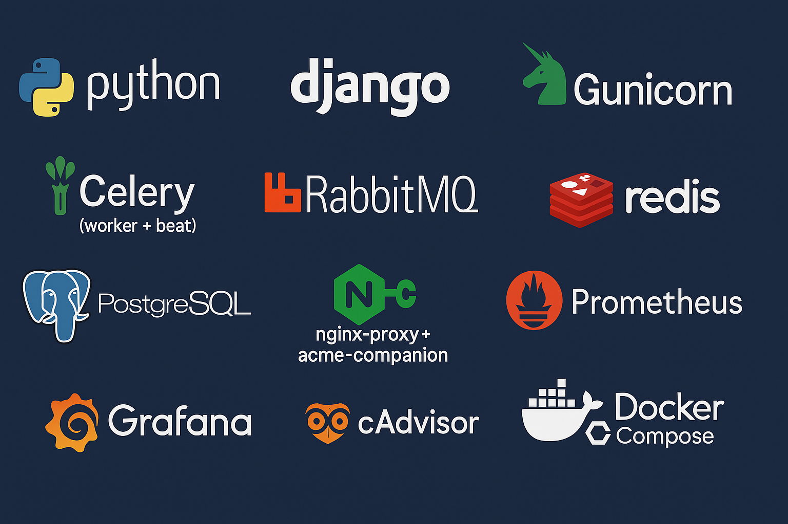
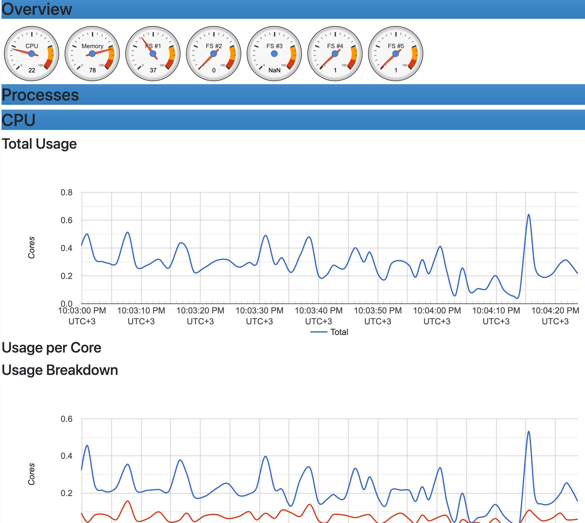
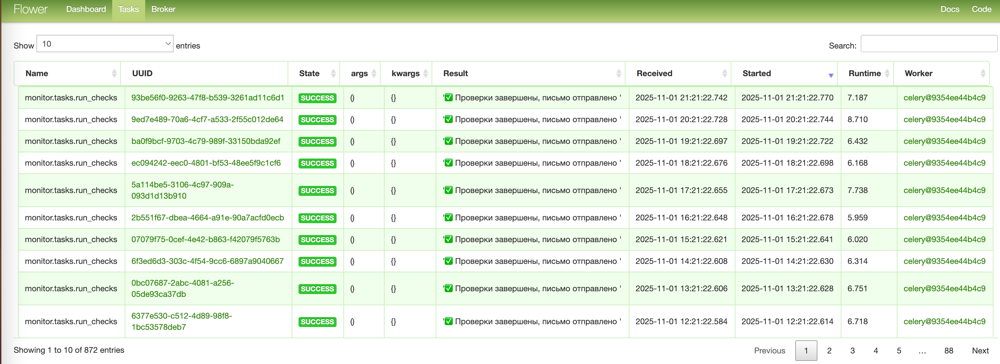
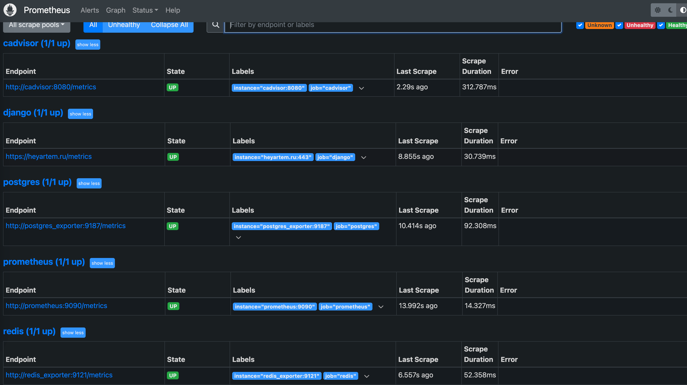
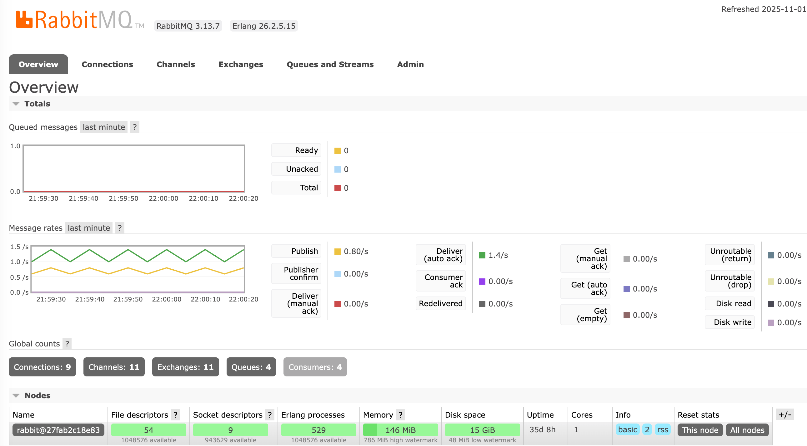

# Async Link Monitor
## (Django + Celery + RabbitMQ + Docker)

---



Django‑сервис, который по расписанию проверяет сайты (Celery Beat), складывает результаты <br> в Postgres и шлёт e‑mail‑сводку. <br> Работает за nginx‑proxy  с автосертификатами Let’s Encrypt. Метрики — Prometheus/Grafana.


## 🛠️ Стек:
- Backend: Django 4.x + Gunicorn
- Очереди: Celery (worker + beat), брокер RabbitMQ, результаты в Redis
- БД: PostgreSQL 14
- Реверс‑прокси: nginx-proxy + acme-companion (HTTPS, автосерты)
- Мониторинг: Prometheus, Grafana, cAdvisor, PostgreSQL/Redis exporters
- Контейнеризация: Docker Compose

---



## 📋 Описание
Сервис хранит список сайтов, периодически (beat) отдаёт их на проверку воркерам (worker). <br>
Проверка — асинхронный HTTP‑запрос, результат сохраняется в БД. <br> После прохода — отправка e‑mail‑сводки.

<br>

Основные сущности:
 - Website(url) — наблюдаемый сайт
 - Check(website, status_code, response_time_ms, is_online, created_at) — результат проверки
---


## 🗂 Структура
```python
├── django_celery_rabbitmq_docker
│   ├── __init__.py
│   ├── __pycache__
│   ├── asgi.py
│   ├── celery.py
│   ├── settings.py
│   ├── urls.py
│   └── wsgi.py
├── docker
│   └── entrypoint.sh	# миграции/collectstatic/ выполняется при старте контейнеры, до command
├── docker-compose.yml	# какие контейнеры запустить, в какой последовательности
├── docs	# баннеры для readme
├── manage.py
├── monitor
│   ├── __init__.py
│   ├── __pycache__
│   ├── admin.py
│   ├── apps.py
│   ├── migrations
│   ├── models.py
│   ├── tasks.py	# run_checks (Celery)
│   ├── tests.py
│   ├── utils.py	# send_summary_email()
│   └── views.py
├── monitoring
│   └── prometheus.yml	# цели для Prometheus
├── proxy-compose.yml	# реверс‑прокси + LE
├── readme.md
├── requirements.txt
```


---

## ⚙️ Особенности
- Асинхронная проверка сайтов (httpx, follow redirects)
- Ограничение частоты писем (в админке)
- /metrics для Prometheus (пакет django-prometheus)
- Готовая интеграция с Grafana (дашборды собираются из PromQL)

---



---
## 👽 UI:
- Prometheus: http://<IP>:9090

- Grafana: http://<IP>:3000

- cAdvisor: http://<IP>:8080

- Flower: http://<IP>:5555

- RabbitMQ: http://<IP>:15672

---

```text
                      [Пользователь]
                            ↓
                       [Internet]
                            ↓
+-------------------- Docker-Compose ---------------------+
| [статик/безопасн.] <-> [nginx-proxy] <-> [acme-comp.]   |
|                          |                              |
|                      HTTP/HTTPS                         |
|                          ↓                              |
|      [Gunicorn :8000] (Python server)← WSGI             |
|                          ↓                              |
|                      [Django] → [PostgreSQL]            |
|                          ↑                              |
|       [Celery beat/worker] → [RabbitMQ] / [Redis]       |
+--------------------------------------------------------+

```




<hr>


